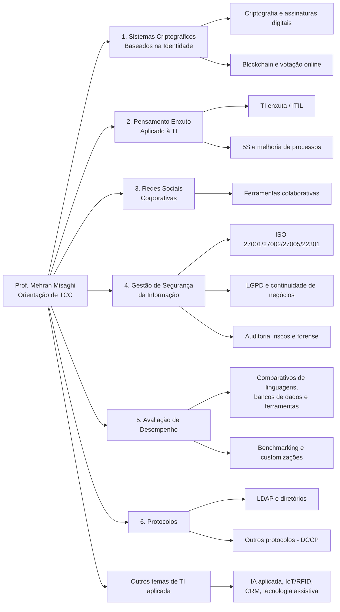

# Linhas de Pesquisa para Orientação de TCC (Graduação)
**Prof. Mehran Misaghi**

Este documento apresenta as linhas de pesquisa disponíveis para orientação de Trabalhos de Conclusão de Curso (TCC) na graduação, com exemplos de trabalhos já orientados em cada uma. O objetivo é ajudar novos alunos a identificar temas de interesse e ver o tipo de problema, escopo e abordagem que já foram trabalhados.

> Observação: os TCCs listados foram extraídos do currículo Lattes e agrupados por afinidade temática com cada linha. Alguns trabalhos têm caráter interdisciplinar; nesses casos foram alocados na linha predominante.

## Fluxograma das linhas de pesquisa (TCC)

---

## 1. Sistemas Criptográficos Baseados na Identidade

**Objetivo:** estudar e avaliar a estrutura de sistemas criptográficos baseados na identidade e sua aplicabilidade em outros campos da criptografia — assinaturas em grupo, esquemas de acordo de chaves e criptoassinaturas.

**Palavras-chave:** algoritmos criptográficos, assinatura em grupo, sistemas baseados em identidade, avaliação de sistemas criptográficos, esquemas de acordo de chaves, criptoassinatura, blockchain.

**Trabalhos já orientados nesta linha:**
- ELVERSON VILHARROEL TARIFA — *Votação Online Utilizando Sistema Baseado em Blockchain* (2019)
- Analice Poffo — *Estudo Comparativo de Esquemas de Assinatura Baseado na Identidade* (2008)
- Luis Mello — *Criptografia em Dispositivos Móveis* (2007)
- João Lenz — *Implementação do esquema de Acordo de Chaves Baseada na Identidade conforme modelo de Shim* (2007)
- Cristiane Salles — *Assinatura Digital com Níveis Adicionais de Autenticação* (2007)
- Anderson da Luz — *Análise de Desempenho de Sistemas Criptográficos* (2006)
- Liana Leopold — *Sistemas Criptográficos Baseados na Identidade, da Teoria à Prática* (2006)
- Robson Poffo — *Implementação da Aplicabilidade de Criptossistemas Baseados em Identidade* (2006)
- Antonio Carlos Alves — *Implementação de um Esquema de Acordo da Chave Baseado em Identidade* (2006)
- Aline Guimaraes — *Aspectos Legais de Mecanismos Criptográficos* (2006)
- Edvandro Mendes — *A Utilização de Sistemas Criptográficos para Envio e Recebimento Seguro de Dados* (2005)

---

## 2. Pensamento Enxuto Aplicado à TI

**Objetivo:** aplicar princípios do pensamento enxuto (Lean) à gestão de tecnologia da informação e de serviços, incluindo governança, ITIL e melhoria de processos.

**Palavras-chave:** Lean IT, TI enxuta, ITIL, governança de TI, melhoria contínua, gestão de serviços.

**Trabalhos já orientados nesta linha:**
- Thiago Bramati — *Framework para Gerenciamento de Solicitações de Serviços Baseado em TI Enxuta e ITIL* (2020)
- Israel dos Santos, Romildo Dalla Rosa — *Análise Comparativa da Implantação dos Cinco Sensos em Organizações de Vários Segmentos na Região de Joinville* (2017)
- Claudine Silva — *Uma Abordagem Prática para Implementação de ITIL com Ênfase na Gerência da Configuração* (2008)
- Marcos Wessler — *Como está o Gerenciamento de Serviços nas Empresas de Joinville e Região* (2006)

---

## 3. Redes Sociais Corporativas

**Objetivo:** estudar o uso de redes sociais e ferramentas colaborativas em ambiente corporativo.

**Palavras-chave:** redes sociais corporativas, colaboração, ferramentas colaborativas.

**Trabalhos já orientados nesta linha:**
- Alisson André do Prado — *Redes Sociais Colaborativas em Ambiente Corporativo* (2012)
- Joelma Lazzari da Silva — *Estudo sobre a Utilização de Ferramentas Colaborativas na Região de Joinville* (2008)

---

## 4. Gestão de Segurança da Informação

**Objetivo:** propor mecanismos que auxiliem na gestão de segurança da informação com base em normas da família ISO/IEC 27000, incluindo continuidade de negócios, LGPD, auditoria e riscos.

**Palavras-chave:** segurança da informação, gestão de segurança, política de segurança, ISO 27001, ISO 27002, ISO 27005, ISO 22301, LGPD, plano de continuidade de negócios (PCN), auditoria, gestão de riscos.

**Trabalhos já orientados nesta linha:**
- Diogo Aquino — *Implementação da NBR ISO/IEC 27001:2022 na Segurança da Informação de um Cartório de Registro de Imóveis* (2025)
- Everton Segur, Luis Fernando da Silva — *Protótipo de Sistema de Autenticação Utilizando Comportamento Humano como Fator de Segurança* (2022)
- João José Furtado Neto — *Plano de Recuperação de Desastres em TI com Foco no ERP* (2021)
- Milton Machado Pereira da Silva — *Estudo de Caso sobre a Aplicação da LGPD na Área da Psicologia Clínica* (2021)
- Tomi Alexander Arndt — *Alta Disponibilidade em Ambientes Virtualizados: Avaliação sobre uma Perspectiva de Baixo Custo* (2021)
- Eduardo Prestes Silva — *Proposta de Plano de Continuidade de Negócio em TI para um Hospital Norte Catarinense* (2021)
- Alexandre de Lima, Jonnatan Fenrich — *Desenvolvimento de Sistema de Verificação de Conformidade com as Normas ISO 27001, ISO 27002 e LGPD* (2020)
- Mateus Valcanaia — *Desenvolvimento de Sistema de Auditoria da Norma ISO 22301* (2020)
- André F. C. Mello, Phellipe H. Pereira — *Detecção de Ataques de Negação de Serviço Distribuído com Auxílio de Aprendizagem de Máquina* (2020)
- Gabriel Lorenzi Paradela, Gustavo Henrique Krug da Silva — *Desenvolvimento de Framework para Implantação da Lei Geral de Proteção de Dados Pessoais* (2019)
- Lucas Nass — *Avaliação de Riscos em uma Empresa de Grande Porte do Norte Catarinense Utilizando a Ferramenta ServiceNow* (2018)
- Roger de Oliveira Afonso — *Plano de Continuidade de Negócios Aplicado ao Serviço de Monitoramento de Servidores* (2018)
- Alvaro Stray Kramel — *O Uso do Método DKIM no Correio Eletrônico como Ferramenta de Segurança nas Empresas de Joinville e Região* (2017)
- Aline da Silva Moreira, William Deivid da Silva — *Proposta de um Plano de Continuidade de Negócios em Segurança da Informação* (2017)
- Iohann Lucas Oro — *Desenvolvimento de uma Ferramenta para Auditoria da Segurança da Informação* (2016)
- Ruan Batista — *Proposta de uma Metodologia para Avaliação de Riscos em Segurança da Informação em uma Empresa de Médio Porte do Norte Catarinense* (2014)
- DAMMY LUCAS RUECKERT — *Sistema de Detecção de Intrusão Colaborativo Baseado em Regras* (2014)
- Jéssika da Silva — *Plano de Continuidade de Negócios com Foco em Gestão de Risco* (2012)
- Marcel Jerônimo Dias Bueno — *Comparação das Duas Versões da NBR ISO/IEC 27005 e a Implantação da NBR ISO/IEC 27005:2011* (2012)
- Lucas Tiago Girelli — *Ameaças Virtuais para Smartphones: Um Estudo de Caso* (2012)
- Julio Luiz do Amaral — *Gestão de Risco de TI em Convergência com a Norma NBR ISO/IEC 31000* (2011)
- Clederson Eckstein — *Gestão de Riscos de Segurança da Informação para Processos de Produção Industrial* (2011)
- Rafaela Schaldach — *A Gestão de Processos com Foco em Plano de Continuidade Organizacional* (2010)
- Rafael Mendes — *Redundância de Enlace, DNS e Firewall Fornecendo Alta Disponibilidade para Serviços Web* (2010)
- Érico Oliveira — *Gerenciamento de Riscos através de NBR ISO/IEC 27005:2008* (2009)
- José Haroldo Giroldo Jr. — *Impacto de Família da Norma ISO 27000 em Segurança da Informação* (2009)
- Ivanor Ipossamai — *Auditoria e Auditabilidade* (2007)
- Rodrigo Ponick — *Proposta para Implementação de uma Política de Segurança da Informação Baseada na NBR/ISO IEC 27001:2006* (2007)
- Talita Caroline Oliveira — *Estudo de Mecanismos de Segurança Física da Informação* (2007)
- Bruno Mathies — *Computação Forense: A Utilização de Examinadores de Vulnerabilidades (Exploits) para Auxílio na Prevenção a Crimes Cibernéticos* (2007)
- Grasiela Fachini — *Aspectos Legais da Proteção da Segurança da Informação* (2006)
- Ádamo Eduardo Apati de Souza Leal — *Perícia Forense: Da Teoria à Prática* (2006)
- Valmir Gomes — *A Utilização de Gestão Adequada de Riscos para Redução das Vulnerabilidades em Ambientes Corporativos* (2006)
- Ricardo L. B. Fontona — *Sistemas de Detecção e Prevenção de Intrusão* (2005)
- Cristhiany Schiessl Alves dos Santos — *Como está a Gestão de Segurança da Informação nas Empresas da Região de Joinville sob a Aplicação da NBR ISO/IEC 17799* (2005)
- Bruno Francisco Cardoso — *A Utilização de Ferramentas e Metodologia de Perícia Forense para Desvendar Crimes Cibernéticos* (2005)
- Anderson Lourival Schmidt — *O Papel das Vulnerabilidades Humanas Frente à Prática da Engenharia Social* (2005)

---

## 5. Avaliação de Desempenho

**Objetivo:** comparar, avaliar e otimizar o desempenho de linguagens, bancos de dados, ferramentas e sistemas, incluindo estudos de benchmarking e customizações de sistemas.

**Palavras-chave:** avaliação de desempenho, estudo comparativo, benchmarking, otimização, customização de sistemas.

**Trabalhos já orientados nesta linha:**
- Marcus Vinícius da Costa Graciano — *Estudo Comparativo de Linguagens de Programação Cython e Python em Termos de Desempenho* (2025)
- Julia Colognese — *Comparativo de Desempenho entre os Bancos de Dados Relacionais SQL Server e MySQL em Transações OLTP* (2025)
- Poliane Ketterine Valdrich — *Avaliação de Desempenho de Sistema Web: Um Estudo de Caso por Meio de Testes Automatizados* (2013)
- Andressa Aparecida de Souza — *Análise Comparativa de Ferramentas de Armazenamento Online que Utilizam Computação em Nuvem* (2013)
- Maíra Tontini — *Avaliação do Comportamento dos Sistemas de Quóruns Temporizados para MANETs Comparado com Sistemas de Quóruns Probabilísticos* (2011)
- Agnes Pizzi — *Customizações e Migrações dos Sistemas Integrados de Gestão Empresarial* (2008)
- José Ricardo Maçaneiro — *Utilização de Ferramentas Administrativas para a Otimização de Consultas SQL em Banco de Dados Oracle* (2008)
- Mozer Calabaide — *Análise de Desempenho em Banco de Dados Multidimensionais* (2008)
- Eder Santos — *Benchmarking como Ferramenta de Incremento à Produtividade: Caso Logística Indústria Têxtil* (2006)
- Cláudio Mueller — *Avaliação de Desempenho de Servidores Web através dos Parâmetros Latência, Vazão e Utilização* (2005)

---

## 6. Protocolos

**Objetivo:** estudar, implementar e avaliar protocolos de rede e de diretórios, como LDAP e DCCP.

**Palavras-chave:** protocolos de rede, LDAP, diretórios, DCCP.

**Trabalhos já orientados nesta linha:**
- Thiago Trufelli — *Análise Comparativa entre os Back Ends do OpenLDAP* (2011)
- Eduardo Coral — *Teorização e Implementação do Protocolo DCCP* (2005)
- Edson Machado de Sousa — *Implementação de um Serviço de Diretórios Utilizando o Protocolo LDAP* (2004)

---

## Outros temas de TI orientados (fora das linhas principais)

Trabalhos de TI aplicada que não se enquadram diretamente nas linhas acima, mas que podem interessar a quem busca temas correlatos:

- Julia Duarte Solano — *IA Aplicada à Gestão Ágil: Solução Estratégica para o Product Owner com Ferramentas Existentes e Hiperautomação* (2026)
- Beatriz de Almeida Uber — *Ponto de Equilíbrio na Utilização da Tecnologia* (2020)
- Rodrigo Magenis, Thiago Lino Adami — *Desenvolvimento de um Protótipo de Geração de Energia Fotovoltaica Baseado em Tecnologia da Informação* (2020)
- Alice Neves Scholze — *Um Protótipo de Tecnologia Assistiva Aplicado no Auxílio a Pessoas com Deficiência Visual na Travessia de Semáforos* (2019)
- Anderson da Silva Viertel, Danielle Ikeda — *Papel do CRM na Identificação de Oportunidades de uma Empresa Multinacional do Setor Metalúrgico* (2018)
- Carlos R. da Silva Godoi, Jean C. Rosa, Ricardo dos Santos — *Satisfação dos Funcionários da CDL de Joinville com Relação aos Procedimentos de Compras e Estoque* (2017)
- Michelle Mota — *Migração de Serviços para Computação nas Nuvens: Um Estudo de Caso* (2013)
- Lauan Roberto Coelho — *Implementação da Computação em Nuvens Utilizando Ferramenta Microsoft: O Caso SOCIESC* (2011)
- Fabrício de Jesus — *Gestão de Dados em Processo de Arquivamentos de Imagens Radiológicas* (2008)
- Luana Soares — *Impacto da Implantação da Nota Fiscal Eletrônica em uma Organização* (2007)
- Elias Godinho — *Aplicação do RFID na Cadeia de Suprimentos e Sistemas Produtivos* (2007)
- Fabio Siedschlag — *Desenvolvimento de Fornecedores para Projetos Específicos dentro da Indústria de Construção e Saneamento* (2006)
- Alan G. S. Tostini — *Soluções RAID para Prevenção de Falhas Ocorridas em Discos Rígidos de Computador* (2005)

---

*Documento gerado a partir do Currículo Lattes de Mehran Misaghi (ID Lattes: 7384745307950075), atualizado em 17/08/2026.*
