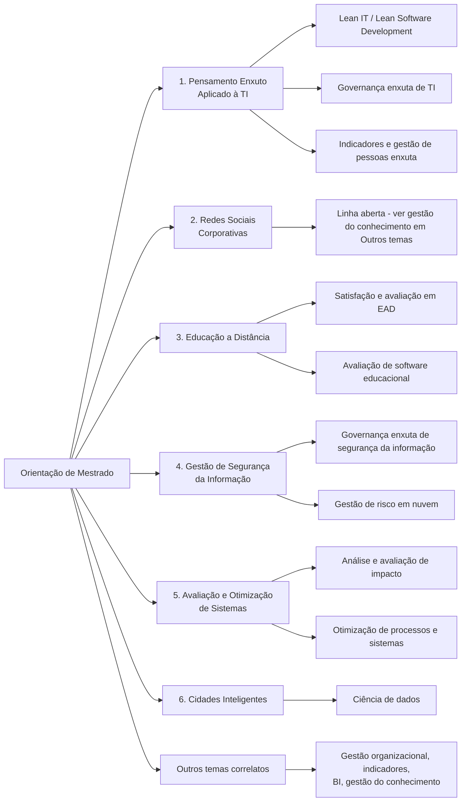

# Linhas de Pesquisa para Orientação de Mestrado
**Prof. Mehran Misaghi**

Este documento apresenta as linhas de pesquisa disponíveis para orientação de dissertações de mestrado, com exemplos de dissertações já orientadas em cada uma. O objetivo é ajudar novos alunos a identificar temas de interesse e ver o tipo de problema, escopo e abordagem que já foram trabalhados — a maior parte das dissertações foi orientada em programas de Mestrado (Profissional) em Engenharia de Produção.

> Observação: as dissertações listadas foram extraídas do currículo Lattes e agrupadas por afinidade temática com cada linha. Alguns trabalhos têm caráter interdisciplinar; nesses casos foram alocados na linha predominante.

## Fluxograma das linhas de pesquisa (Mestrado)

---

## 1. Pensamento Enxuto Aplicado à TI

**Objetivo:** aplicar princípios do pensamento enxuto (Lean) à gestão de TI, de projetos de software e de processos organizacionais.

**Palavras-chave:** Lean, Lean IT, Lean Software Development, TI enxuta, governança enxuta, gestão de pessoas enxuta, indicadores.

**Dissertações já orientadas nesta linha:**
- Juliano Daniel Marcelino — *Proposta de uma Ferramenta de Gestão de TI Baseada em Princípios de Pensamento Enxuto* (2019)
- Iur Cristine Moraes — *Técnica de Gerenciamento de Projeto de Software Baseado no Pensamento Enxuto* (2019)
- Ricardo Pereira — *Implantação da Saúde Enxuta como Técnica Gerencial para Melhorar o Desempenho de um Laboratório de Análises Clínicas* (2019)
- Juliane Mews Cardoso — *Aplicação da Mentalidade Enxuta na Implantação de Indicadores Financeiros de Desempenho em uma Indústria Têxtil de Gaspar/SC* (2017)
- Mauro Gonçalves Pinheiro — *Modelo de Governança e Gerenciamento Enxuto de TI Empresarial* (2016)
- Patricia da Cunha Torres Silveira — *Um Modelo Lean de Desenvolvimento de Software* (2016)
- Ivan Bosnic — *Os Impactos de Desenvolvimento Lean de Software: Estudo de Caso em uma Empresa de Médio Porte em Santa Catarina* (2013)
- Robson Thanael Poffo — *Proposta de Avaliação de Indicadores de Lean Aplicados à Gestão de Pessoas em uma Empresa de Desenvolvimento de Software* (2013)

*Trabalho relacionado, com foco combinado em Lean + Segurança da Informação (ver também a linha 4):*
- Tarcizio Pinto — *Proposta de uma Técnica Gerencial de Governança Enxuta de Segurança da Informação (TGESI) para Órgãos Públicos* (2017)

---

## 2. Redes Sociais Corporativas

**Objetivo:** estudar o uso de redes sociais e ferramentas colaborativas em ambiente corporativo.

**Palavras-chave:** redes sociais corporativas, colaboração, gestão do conhecimento.

*Nenhuma dissertação de mestrado orientada nesta linha foi identificada diretamente, mas trabalhos próximos sobre ferramentas de gestão do conhecimento foram orientados (ver "Outros temas" abaixo) — linha aberta a novos alunos.*

---

## 3. Educação a Distância

**Objetivo:** estudar fatores relacionados ao ensino a distância (EAD): satisfação de alunos, avaliação de ferramentas e modelos de avaliação educacional.

**Palavras-chave:** EAD, educação a distância, avaliação educacional, satisfação do aluno.

**Dissertações já orientadas nesta linha:**
- Ana Elisa Pillon — *Estudo dos Fatores de Satisfação dos Alunos da Educação a Distância de uma Instituição de Ensino Superior do Norte do Estado de Santa Catarina* (2016)
- Juliana Spanevello Fitz — *Modelo Avaliativo de Software Voltado para Educação Corporativa* (2017)
- Paulo Rogério Pires Manseira — *Um Método para Execução de Avaliações Educacionais Diagnósticas* (2016)

---

## 4. Gestão de Segurança da Informação

**Objetivo:** propor mecanismos que auxiliem na gestão de segurança da informação com base em normas da família ISO/IEC 27000.

**Palavras-chave:** segurança da informação, gestão de segurança, política de segurança, ISO 27001, ISO 27002, gestão de riscos em TI, computação em nuvem.

**Dissertações já orientadas nesta linha:**
- Tarcizio Pinto — *Proposta de uma Técnica Gerencial de Governança Enxuta de Segurança da Informação (TGESI) para Órgãos Públicos* (2017) — *ver também a linha 1 (Pensamento Enxuto)*
- Jilsimaico Daru — *CLOUDRISK: Framework de Suporte ao Gerenciamento do Risco na Prevenção e Detecção de Falhas para Serviços na Nuvem* (2016)

---

## 5. Avaliação e Otimização de Sistemas

**Objetivo:** analisar e avaliar o impacto da adoção de sistemas e tecnologias, e propor otimizações de processos, softwares e integrações.

**Palavras-chave:** análise de impacto, avaliação de sistemas, otimização de processos, modelos avaliativos.

**Dissertações já orientadas nesta linha:**
- Celso Waldemar Castella — *Análise de Impacto da Aplicação da Gestão de Riscos no Planejamento Estratégico* (2018)
- Gilberto Tiago Moreira — *Avaliação do Impacto da Adoção de um Software na Gestão de Laboratórios de uma Instituição de Ensino* (2018)
- Rommel Souza da Silva — *Elaboração de Indicadores Chave de Desempenho como Técnica Gerencial para o Setor de Obras Públicas do Instituto Federal Catarinense* (2018)
- Genilson Tiburski — *Avaliação do Impacto da Integração dos Softwares SCADA e ERP para Otimização na Análise da OEE em uma Empresa do Ramo Metalmecânico* (2017)
- Eloir Francisco Milano da Silva — *Desenvolvimento de uma Ferramenta de Avaliação da Competitividade de Escritórios de Advocacia* (2017)
- Leila Regina Techio — *MASNuvem: Um Modelo Avaliativo de Serviços em Nuvem* (2014)

---

## 6. Cidades Inteligentes (PPGTA)

**Objetivo:** estudar tecnologias, modelos de gestão e indicadores aplicados ao desenvolvimento de cidades inteligentes (smart cities).

**Palavras-chave:** cidades inteligentes, smart cities, gestão urbana, tecnologia aplicada ao espaço urbano, comunicação, modelos preditivos, sensoriamento e monitoramento de baixo custo

- Marco Antônio dos Santos -*Sistema de Apoio à Decisão para Gestão do Consumo de Água no Município de Joinville Utilizando Ciência de Dados*(Iniciado em 2026)

---

## Outros temas orientados (fora das linhas principais)

Dissertações em Engenharia de Produção com foco em gestão organizacional, indicadores e tecnologia aplicada que não se enquadram diretamente nas linhas acima, mas que podem interessar a quem busca temas correlatos:

- Ana Paula Werka Rossa — *Identificação dos Fatores que Contribuem para Evasão nos Cursos de Engenharia de uma IES no Norte Catarinense* (2019)
- Francisco Olizéte Vargas — *Diagnóstico do Perfil Resiliente na Segurança do Trabalho em Trabalhadores em Pequenas Empresas do Setor da Construção Civil na Região de Joinville* (2019)
- Gerson Dolberth — *Mitigação de Riscos em Processos de Execução de Obras de uma Empresa da Construção Civil* (2019)
- Cintia Ghisi — *INFORSYSTEM: Um Sistema Aplicado ao Quadrante de Combinação de Conhecimento* (2015)
- Alcir Mário Trainotti Filho — *FGCConv: Ferramenta de Gestão de Conhecimento Convergente* (2014)
- Aldérico Silvio Gulini — *MRepAD: Um Modelo de Reputação como Ferramenta de Apoio à Decisão* (2014)
- Claudinete Vieira Martins — *Uma Proposta de Plano de Comunicação Visando Redução de Falhas nos Projetos de Software, Aderente à MPS.BR* (2014)
- Márcio Rodrigo Teixeira — *MoABI: Um Modelo Avaliativo de Business Intelligence para IES* (2014)

---

*Documento gerado a partir do Currículo Lattes de Mehran Misaghi (ID Lattes: 7384745307950075), atualizado em 17/08/2026.*
